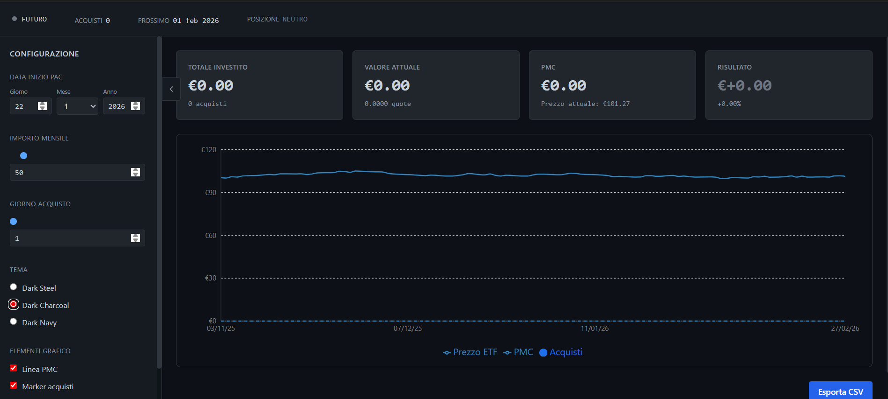

# PAC ETF Dashboard

Dashboard professionale per monitoraggio Piano di Accumulo Capital (PAC) su ETF.
Sviluppata con React, Recharts e Lucide React.



## Features

- ✅ **Configurazione completa via UI** (Importo, Giorno acquisto, Data inizio)
- ✅ **Calcolo automatico** di PMC, Profitto/Perdita, Quote accumulate
- ✅ **Grafico professionale interattivo** (Prezzo vs PMC, Marker acquisti)
- ✅ **3 Temi Dark** (Dark Steel, Midnight Blue, Obsidian)
- ✅ **Responsive Design** (Ottimizzato per desktop e mobile)
- ✅ **Persistenza Configurazione** (Salva le impostazioni tra le sessioni)
- ✅ **Export CSV** (Scarica storico acquisti)
- ✅ **Zero Backend** (Funziona interamente nel browser)

## Setup

Assicurati di avere Node.js installato (versione 16+ raccomandata).

```bash
# Installazione dipendenze
npm install

# Avvio server di sviluppo
npm start
```

La dashboard sarà disponibile su [http://localhost:3000](http://localhost:3000).

## Configurazione Dati

### Dati Mock
Il progetto usa dati simulati in `src/data/mockETFData.js`.
Per modificare i parametri di default, editare `src/config/defaultConfig.js`.

### Integrazione API Reale
Per passare a dati reali (es. Yahoo Finance):
1. Sostituire `generateMockETFData` in `App.js` con una chiamata API `useEffect`.
2. Assicurarsi che l'API restituisca un array di oggetti `{ date: Date, price: number }`.
3. Mappare i dati nel formato richiesto prima di passarli al componente `Chart`.

## Tech Stack

- **Core**: React 18
- **Charting**: Recharts 2.5
- **Icons**: Lucide React
- **Styling**: CSS Modules / Inline Styles (Bloomberd-style dark aesthetic)

## Note Sviluppo

- Struttura modulare (`components/`, `utils/`, `data/`)
- Nessuna dipendenza da localStorage (usa sessionStorage per config)
- Calcoli finanziari isolati in `utils/calculations.js`

## License

MIT